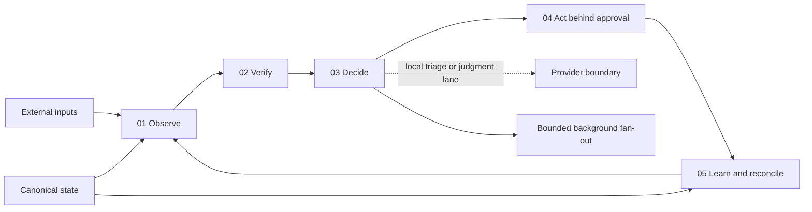

# Runtime architecture

The runtime layer sits beside the upstream agent. It prepares context, owns local state, and controls delivery policy; the upstream project remains responsible for the agent loop and provider integrations.

## Boundaries

### Inputs

Connectors and local tools fetch bounded evidence. Each source should have an explicit owner, freshness rule, and failure behavior.

### Projection

Deterministic code normalizes inputs into a small local projection. It should exclude cancelled, stale, duplicate, or unauthorized data before any model receives context.

### Context builders

Context builders assemble only the fields required by one job. They should preserve provenance and missing-source metadata rather than inventing values.

### Model-driven decisions

The model proposes or summarizes within a narrow contract. `runtime.loop.run_cycle` accepts an injected decision callback after verification; the callback cannot see records that the context boundary removed. It should not silently create state, broaden recipients, or turn an observation into a high-stakes recommendation.

### Routing

`runtime.routing.choose_lane` labels bounded work as `local` and synthesis-heavy work as `judgment`. The public code does not name or configure a provider. A private deployment can map those lanes to local models, cloud models, or a subagent pool without changing the safety contract.

### Delivery

Delivery targets and approval language are explicit. Tests use a non-production destination, and scheduled production delivery is exercised only by the scheduler itself.

External action adapters are intentionally outside this package. Browser automation, claims portals, messaging clients, and other side effects should consume an authorized proposal only after their private deployment has performed its own target and credential checks.

### State

Canonical state is separate from generated projections. Reconciliation jobs repair drift deterministically; they do not become general-purpose planners.

### Outcomes

Each cycle returns a compact outcome summary: fresh signals observed, inputs filtered, proposals made, delivery state, and canonical repairs. This makes “helpful” measurable without retaining message bodies or household records in the public layer.

`runtime.parallel.run_parallel` provides the small fan-out primitive used for independent background work. It caps workers, returns results in stable name order, and reports only exception classes in failures.

## Public-release rule

Reusable logic belongs here only after it has been separated from live data, private prompts, account routing, local paths, and household-specific policy. Synthetic fixtures are preferred over redacted production snapshots.
