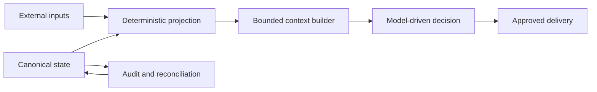

# Runtime architecture

The runtime layer sits beside the upstream agent. It prepares context, owns local state, and controls delivery policy; the upstream project remains responsible for the agent loop and provider integrations.

## Boundaries

### Inputs

Connectors and local tools fetch bounded evidence. Each source should have an explicit owner, freshness rule, and failure behavior.

### Projection

Deterministic code normalizes inputs into a small local projection. It should exclude cancelled, stale, duplicate, or unauthorized data before any model receives context.

### Context builders

Context builders assemble only the fields required by one job. They should preserve provenance and missing-source metadata rather than inventing values.

### Model-driven decisions

The model proposes or summarizes within a narrow contract. It should not silently create state, broaden recipients, or turn an observation into a high-stakes recommendation.

### Delivery

Delivery targets and approval language are explicit. Tests use a non-production destination, and scheduled production delivery is exercised only by the scheduler itself.

### State

Canonical state is separate from generated projections. Reconciliation jobs repair drift deterministically; they do not become general-purpose planners.

## Public-release rule

Reusable logic belongs here only after it has been separated from live data, private prompts, account routing, local paths, and household-specific policy. Synthetic fixtures are preferred over redacted production snapshots.
